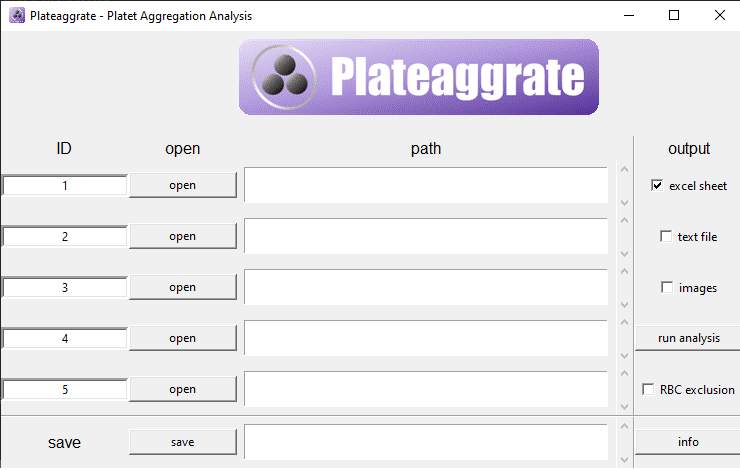

# Plateaggrate
Convolutional Neuronal Network for Identifying Single-Cell-Platelet-Platelet-Aggregates in Human Whole Blood Using Imaging Flow Cytometry (Weighted Platelet Aggregation, WPA)


## Evaluation with Plateaggrate GUI

### Materials:
- Installed version of Plateaggrate

### Procedure:
- **Opening Plateaggrate_GUI.py:**
  - **Function of individual buttons:**
    - **Info Button:** Opens a window with information on how to use the program.
    - **ID Input Window:** Option for annotating data (also in the statistics).
    - **Open/Save Button:** Query for selecting the storage location.
    - **Text Widgets:** Contain the selected hard link.
    - **Radio Buttons:** Choose the output (Excel, text document, images), use of advanced analysis with red blood cell (RBC) exclusion.
- **Opening the folder where the images are located (open):**
  - Then the path is displayed.
  - ID is a text field used to identify the sample and is also saved in the Excel/text file.
- **Save:** Choose storage path.
- **Output:**
  - Select the type of output:
    - Excel sheet.
    - Text file.
    - Individual images (could theoretically be counted/checked).
- **RBC-exclusion:**
  - Removes platelet-red blood cell images.



### Output:
The output formats available are "Excel", "txt", and image. In addition, the images can be sorted. The individual classifications can also be found in the Excel file and are summarized as weighted platelet aggregation (WPA).


## Installation of Plateaggrate

- **Download from:** [Anaconda Distribution](https://www.anaconda.com/products/distribution)
  - Scroll down.
  - Select the version.
- **Python Installation:**
  - Standard installation.
  - Add Conda to PATH variable.
- **Development Environment (optional):**
  - **Two options:**
    - 1: Without development environment (IDE)
    - 2: With development environment (IDE)
      - i.e., installation of a program in which one can program.
      - Useful if you want to program in the future.
    - **1: Without IDE:**
      - Simply skip this step.
    - **2: With IDE:**
      - There are many, some included in Anaconda.
      - I recommend Visual Studio Code: [Visual Studio Code](https://code.visualstudio.com/)
- **Install software packages and dependencies:**
  - Open Anaconda Prompt in the Plateaggrate folder.
  - Change to the path (modify): `cd C:\Users\Path\to\Plateaggrate\Folder`
  - Follow instructions in the `requirements_plateaggrate_230121.txt` file (type in the Conda shell and hit enter):
    ```
    conda create -n plateaggrate_01 python=3.9.13 -y
    conda activate plateaggrate_01
    pip install -r requirements_plateaggrate_230121.txt
    ```
  - Wait until installation is complete.

